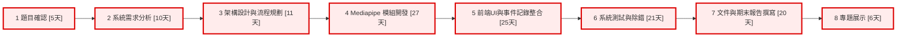
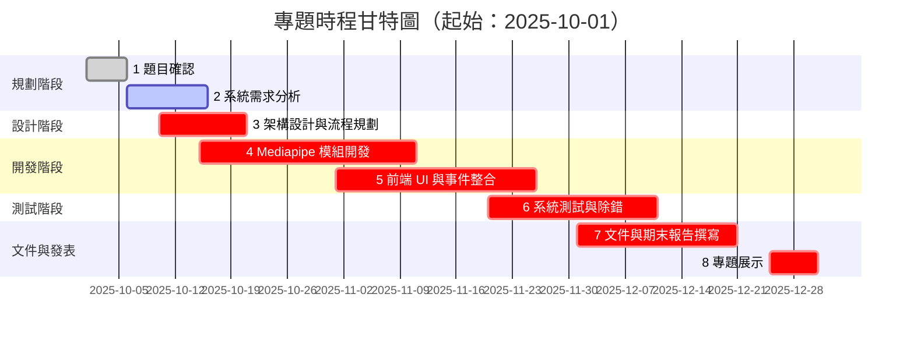

# TEST

```mermaid
flowchart LR
n1["1 題目確認 [5天]"]
n2["2 系統需求分析 [10天]"]
n3["3 架構設計與流程規劃 [11天]"]
n4["4 Mediapipe 模組開發 [27天]"]
n5["5 前端UI與事件記錄整合 [25天]"]
n6["6 系統測試與除錯 [21天]"]
n7["7 文件與期末報告撰寫 [20天]"]
n8["8 專題展示 [6天]"]

n1 --> n2 --> n3 --> n4 --> n5 --> n6 --> n7 --> n8

classDef crit stroke-width:3px,stroke:#d00,fill:#ffecec;
class n1,n2,n3,n4,n5,n6,n7,n8 crit;
```

```mermaid
gantt
title 專題時程甘特圖（起始：2025-10-01）
dateFormat  YYYY-MM-DD

section 規劃階段
1 題目確認                :done, 2025-10-01, 5d
2 系統需求分析            :active, 2025-10-06, 10d

section 設計階段
3 架構設計與流程規劃      :crit, 2025-10-10, 11d

section 開發階段
4 Mediapipe 模組開發      :crit, 2025-10-15, 27d
5 前端 UI 與事件整合      :crit, 2025-11-01, 25d

section 測試階段
6 系統測試與除錯          :crit, 2025-11-20, 21d

section 文件與發表
7 文件與期末報告撰寫      :crit, 2025-12-01, 20d
8 專題展示                :crit, 2025-12-25, 6d
```
