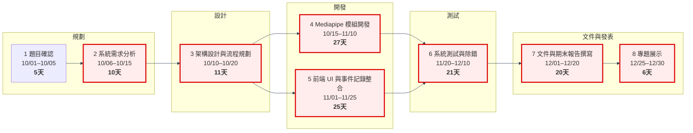
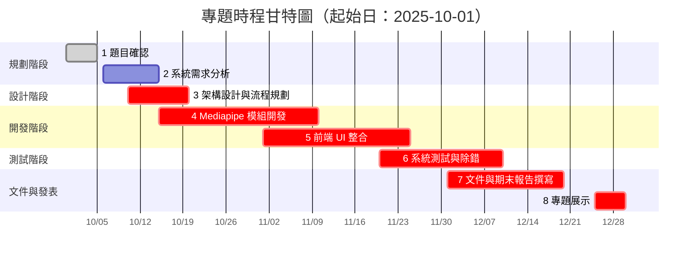

# TEST

```mermaid
%%{init: {
  "flowchart": { "curve": "basis", "htmlLabels": true },
  "themeVariables": {
    "fontSize": "18px",
    "primaryColor": "#eef4ff",
    "primaryTextColor": "#0f172a",
    "primaryBorderColor": "#334155",
    "lineColor": "#334155"
  }
}}%%
flowchart LR
  %% 區塊分泳道（模擬時程重疊）
  subgraph 規劃
    n1["1 題目確認<br/>10/01–10/05<br/><b>5天</b>"]
    n2["2 系統需求分析<br/>10/06–10/15<br/><b>10天</b>"]
  end

  subgraph 設計
    n3["3 架構設計與流程規劃<br/>10/10–10/20<br/><b>11天</b>"]
  end

  subgraph 開發
    n4["4 Mediapipe 模組開發<br/>10/15–11/10<br/><b>27天</b>"]
    n5["5 前端 UI 與事件記錄整合<br/>11/01–11/25<br/><b>25天</b>"]
  end

  subgraph 測試
    n6["6 系統測試與除錯<br/>11/20–12/10<br/><b>21天</b>"]
  end

  subgraph 文件與發表
    n7["7 文件與期末報告撰寫<br/>12/01–12/20<br/><b>20天</b>"]
    n8["8 專題展示<br/>12/25–12/30<br/><b>6天</b>"]
  end

  %% 任務順序與重疊（模擬並行）
  n1 --> n2
  n2 --> n3
  n3 --> n4
  n3 --> n5
  n4 --> n6
  n5 --> n6
  n6 --> n7
  n7 --> n8

  %% 美化樣式（關鍵區塊加粗紅框）
  classDef crit stroke:#d00,stroke-width:3px,fill:#ffecec;
  class n2,n3,n4,n5,n6,n7,n8 crit;

```

```mermaid
%%{init:{
  "theme":"base",
  "themeVariables":{
    "fontSize":"20px",
    "fontFamily":"Inter, Noto Sans TC, system-ui",
    "ganttSectionBkgColor":"#f9fafb",
    "ganttSectionBkgColor2":"#f3f4f6",
    "ganttTaskLineColor":"#475569",
    "ganttTaskTextColor":"#0f172a",
    "ganttCritBC":"#fecaca",
    "ganttCritFill":"#fecaca",
    "ganttCritColor":"#7f1d1d",
    "ganttGridLineColor":"#e5e7eb"
  },
  "config":{
    "gantt":{
      "titleTopMargin":45,          /* 標題更大間距 */
      "barHeight":34,               /* 條稍微縮回來一點 */
      "barGap":16,                  /* 增加間距，避免擠出框外 */
      "topPadding":80,
      "leftPadding":160,
      "gridLineStartPadding":60,
      "fontSize":18
    }
  }
}}%%
gantt
title 專題時程甘特圖（起始日：2025-10-01）
dateFormat  YYYY-MM-DD
axisFormat  %m/%d
excludes none

section 規劃階段
1 題目確認     :done,   2025-09-30, 2025-10-05
2 系統需求分析 :        2025-10-06, 2025-10-15

section 設計階段
3 架構設計與流程規劃 :crit, 2025-10-10, 2025-10-20

section 開發階段
4 Mediapipe 模組開發   :crit, 2025-10-15, 2025-11-10
5 前端 UI 整合        :crit, 2025-11-01, 2025-11-25

section 測試階段
6 系統測試與除錯      :crit, 2025-11-20, 2025-12-10

section 文件與發表
7 文件與期末報告撰寫  :crit, 2025-12-01, 2025-12-20
8 專題展示            :crit, 2025-12-25, 2025-12-30

```
